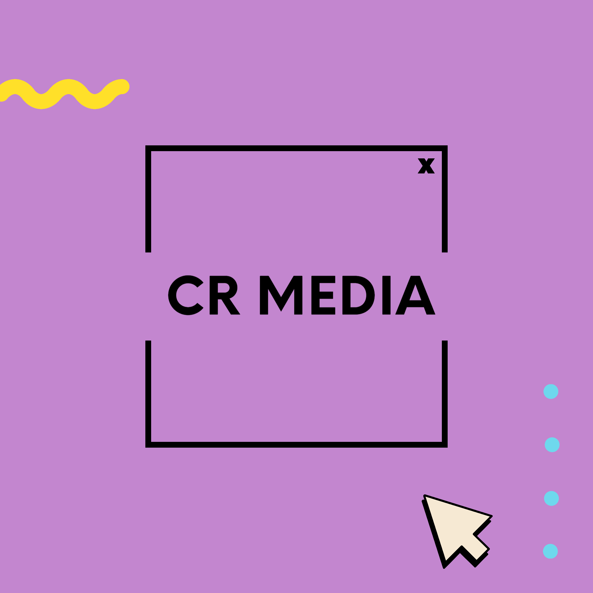

# crmedia

## directory guide

**src** is where all the source code and assets are located *before* compiling. this is where you edit code, add images and stuff etc
 
**src/assets** is where you should put *all* media files that may be of use in the project, even if you dont know if they will be used
 
**public** is the code after compiling which is the code that will be uploaded and shown publically. this is only visible in the public branch and will be ignored in the main branch

 
 
